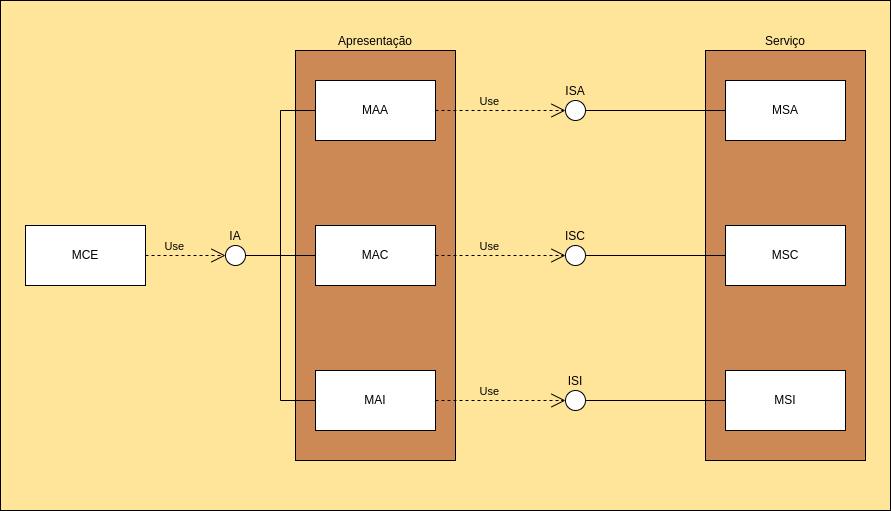

# TP1-Trabalho2 – Arquitetura e Design Patterns

Este projeto é um aplicativo de terminal desenvolvido como parte da disciplina **Técnicas de Programação 1 (TP1)** da **Universidade de Brasília (UnB)**. Seu objetivo principal é aplicar princípios de **arquitetura de software** e **design patterns**, especialmente o padrão **Command** e **State**, além de seguir os princípios do **SOLID**.

## 📐 Arquitetura

### UML de módulos do projeto


### Estrutura Modular

- **MCE:** Ponto de controle de UI e dos dados da execução
- **Presentation:** Interface de terminal
- **Service:** Camada de serviços com o padrão Command

### Design Patterns Utilizados

- **State:** Controla a IU e contem os dados da execução
- **Command:** Implementa a camada de serviço e aplica o princípio da responsabilidade única (**S** do SOLID)
- **Singleton:** Gerencia o acesso compartilhado ao banco de dados

## ⚙️ Tecnologias Utilizadas

- **C++17**
- **Makefile** para automação
- **SQLite3** para persistência
- **Doxygen** para documentação técnica (gerada em `/Docs/doxygen/html/`)

## 🧪 Estado Atual

Atualmente, o projeto **possui uma execução completa** e é possível usá-lo completamente. Porém, **existem melhorias** no sistema de gerenciamento de ordens e na exibição do saldo a **serem feitas**. Além disso, é possível:

- Rodar os **testes unitários**
- Executar funções de gerenciamento do banco de dados
- Navegar pela **documentação Doxygen**

## 🚀 Como Rodar

### Requisitos

- Compilador C++ (g++ com suporte a C++17)
- SQLite3 instalado

### Comandos disponíveis

```bash
# Gera a documentação Doxygen
doxygen Doxyfile

# Para rodar os comandos
mkdir build && cd build

# Compilar
cmake .. && make

# Executar o programa
./main

# Roda os testes
./test_exec

# Limpar o banco de dados (para testes)
./clearDbTest

# Atualiza o banco de dados com dados de teste
./updateData
```

> README redigido com auxílio do ChatGPT para padronização e clareza.